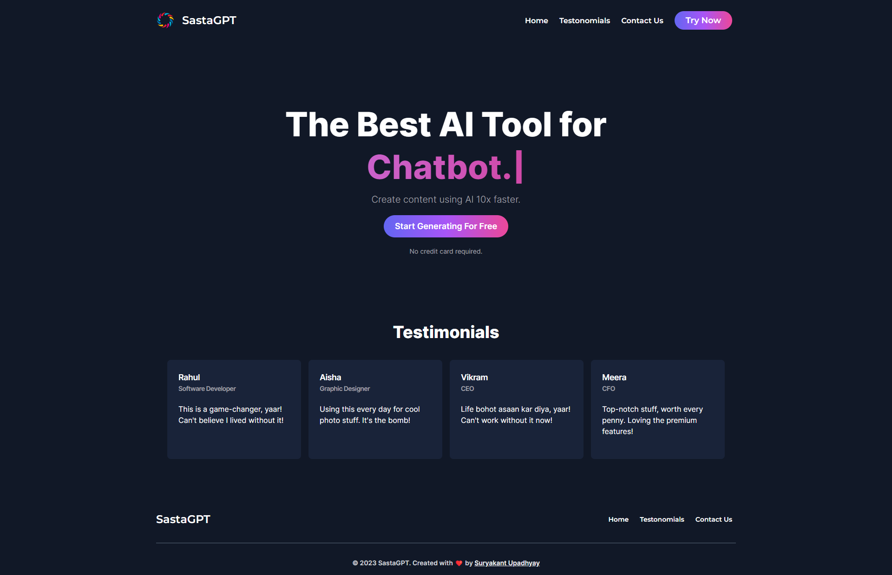
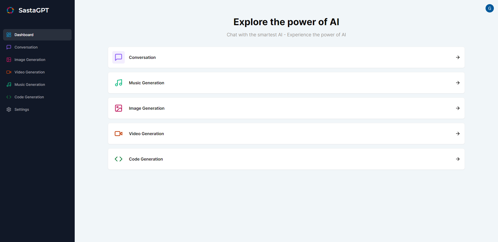

# SastaGPT - Your All-in-One AI Companion 🚀

## Overview

SastaGPT is a Software as a Service (SaaS) website built using Next.js and TypeScript, offering a range of powerful AI-driven features.

## HomePage 🏠



## DashBoard 📊



## Features

### 1. Conversation 💬

Engage in natural language conversations with SastaGPT's advanced language model. Leverage the power of OpenAI's GPT-3.5 architecture to create dynamic and context-aware interactions.

### 2. Music Generation 🎵

Explore the world of AI-generated music. SastaGPT leverages cutting-edge algorithms to compose unique and customizable musical pieces tailored to your preferences.

### 3. Image Generation 🖼️

Generate high-quality images using sophisticated AI models. Whether you need artistic visuals, realistic scenes, or abstract designs, SastaGPT has you covered.

### 4. Video Generation 🎥

Create captivating videos with the help of AI. Combine images, music, and dynamic effects to produce stunning visual content, all driven by SastaGPT's powerful video generation capabilities.

### 5. Code Generation 💻

Boost your productivity with AI-assisted code generation. SastaGPT can help you draft code snippets, suggest improvements, and streamline your development process.

## Getting Started

Follow these steps to set up and run SastaGPT on your local machine:

## 1. **Clone the Repository:**

```
git clone https://github.com/GivenBY/SastaGPT.git
```

## 2. Install Dependencies:

```
cd SastaGPT
npm install
```

## 3. Configure Environment Variables:

- Create a .env.local file in the root directory and add the necessary environment variables. Refer to the provided .env.example for required configurations.

## 4. Run the Application:

```
npm run dev
```

The application will be accessible at http://localhost:3000.

## 5. Configuration

Customize SastaGPT by adjusting the configuration parameters in the .env.local file. This includes API keys, endpoints, and other settings specific to the integrated AI services.

## Contributing

### Contribution is Much More Appreciated 🙌

## License

This project is licensed under the [MIT License](LICENSE.md).
